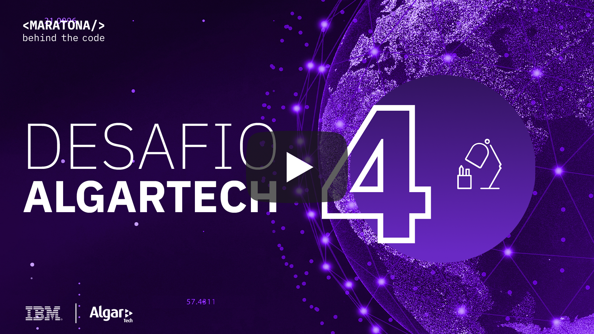

# Desafio 04 | Algar

- [1. Sobre a Algar](#1-sobre-a-algar)
  - [1.1. Introdução](#11-introdução)
  - [1.2. Premiação](#12-premiação)
- [2. Desafio de negócio](#2-desafio-de-negocio)
- [3. Objetivo](#3-objetivo)
- [4. Desenvolvendo a Solução](#4-desenvolvendo-a-solucao)
  - [4.1. Pré-requisitos](#41-pré-requisitos)
  - [4.2. Resumo das tarefas](#42-resumo-das-tarefas)
  - [4.3. Desenvolvimento](#43-desenvolvimento)
- [5. Submissão](#5-submissão)
- [6. Sobre a avaliação](#6-sobre-a-avaliação)

## Para te ajudar

- [Material de Apoio](#material-de-apoio)
- [Em caso de dúvidas](#em-caso-de-duvidas)
- [License](#license)

## 1. Sobre a Algar

### 1.1. Introdução

Há 21 anos repensamos a experiência dos seus clientes e a gestão do ambiente de tecnologia, com um único propósito: conectar pessoas e organizações de um jeito único para ser o melhor parceiro para os seus melhores resultados.

Atuamos em toda a América Latina, e o nosso maior diferencial é a Nossa Gente! Aqui todo mundo se sente em casa. Nosso ambiente é COOL, nossa diversidade é o nosso tempero e o nosso conhecimento é a nossa força.

Nossa missão é conectar pessoas e organizações de um jeito único. Somos feitos para quem busca resultados, e por isso nos comprometemos a transformar o relacionamento entre clientes e empresas por meio de soluções inteligentes.

    

## 2. Desafio de negócio

O turnover alto gera uma série de custos adicionais, indo muito além do impacto na lucratividade, rentabilidade e o próprio crescimento da organização. A saída em excesso cria um clima inadequado, no qual conflitos interpessoais podem ocorrer com maior frequência, e gerando também a perda de conhecimento. A comunicação interna e externa é afetada, impactando inclusive na atração de novos talentos.

## 3. Objetivo

Este desafio tem como objetivo criar um modelo no *Modeler Flow* (SPSS) capaz de encontrar o melhor candidato de acordo com as variáveis do dataset fornecido. Sua terefa é modelar os dados de tal forma que o modelo que recebe como entrada todas as colunas do dataset e forneça como saída se o canditado deve ser contrado ou não.

    

## 4. Desenvolvendo a solução

### 4.1. Pré-requisitos

Para realizar esse desafio você deverá cumprir os seguintes pré-requisitos:

- Registrar-se na [Maratona Behind the Code](https://ibm.biz/maratona) e confirmar seu e-mail de cadastro.
- Possuir uma conta na [IBM Cloud](https://ibm.biz/registro-maratona), podendo ser a conta FREE ou pay-as-you-go (não é necessário registrar-se no evento com o mesmo e-mail utilizado para criar sua conta na IBM Cloud).

### 4.2. Resumo das tarefas

1. Instanciar o Watson Studio (Cloud Pak for Data as a Service) na IBM Cloud - ATENÇÃO: Se você já fez o [desafio 2](https://github.com/maratonadev-br/desafio-2-2020) não precisa instanciar um novo, pode usar a mesma;
2. Instanciar o Watson Machine Learning na IBM Cloud - ATENÇÃO: Se você já fez o [desafio 2](https://github.com/maratonadev-br/desafio-2-2020) não precisa instanciar um novo, pode usar a mesma;
3. Instanciar o Cloud Object Storage na IBM Cloud - ATENÇÃO: Se você já fez o [desafio 2](https://github.com/maratonadev-br/desafio-2-2020) não precisa instânciar um novo, pode usar a mesma;
4. Importar o projeto fornecido neste repositório cloud-pak-project-modeler-flow-4.zip no Watson Studio;
5. Clique em 'Add to project' em seguida insira o *Modeler Flow* no projeto;
6. Escolha a opção 'from file' e faça o upload do arquivo [algar-flow.str](./algar-flow.str)
7. Modele sua solução
8. A saída do seu modelo deve ser uma tabela, você encontra ela no lado esquerdo na aba 'Output'
9. Faça o deploy da tabela no *Watson Machine Learning*
10. Exporte seu *Modeler Flow* e compacte ele numa pasta zip. Você deve submeter ele também
11. Acessar a página [https://algartech.maratona.dev](https://algartech.maratona.dev), testar e submeter sua solução.

### 4.3. Desenvolvimento

A ideia essencial é criar um modelo baseado em machine learning, capaz de contratar o melhor candidato baseado em algumas variáveis permitindo assim a contratação do profissional mais adequado a vaga. Trata-se de um problema de classificação binária, onde a partir da entrada o modelo só existem dois valores possíveis de saída.

Para simplificar o desafio e mostrar ao usuários outras opções de modelagem dentro do Watson Studio (Cloud Pak for Data as a Service) é pedido que seja usado o *Modeler Flow*(SPSS). Sua simplicidade e interface amigável torna acessível o uso, aprendizado e pesquisa na área de ciência de dados por pessoas que não possuem um grande conhecimento em python ou R.

Em linhas gerais, o *Modeler Flow* tem a mesma função de um jupyter notebook, a diferença reside no fato de que a ferramante abstraí a parte do código para focar somente nos dados.

No vídeo do item 3 acima, é explicado o passo a passo do que deve ser feito para criar um modelo no *Modeler Flow*, o deploy do modelo no *Watson Machine Learning* e como submeter sua solução.

Você não é obrigado a criar uma solução utilizando o *Modeler Flow*, fique a vontade para utilizar o jupyter notebook caso desejar, porém a sua solução deve ser estar no *Watson Machine Learning*, a entrada do modelo dever ser obrigatoriamente todos as variáveis contidas no dataset.

Obs: Você é livre para modelar na plataforma que se sentir mais confortável, porém o suporte só será fornecido para o *Modeler Flow*.

## 5. Submissão

Para realizar a submissão, primeiramente você deverá acessar a seguinte aplicação: https://algartech.maratona.dev/ e preencher o formulário com as credenciais de sua instância do **Watson Machine Learning** e a **URL endpoint** para scoring de seu modelo. Nessa página você será capaz de fazer uma predição -- desde que as credenciais e a URL de scoring estejam corretas e o modelo funcione da maneira especificada nos notebooks fornecidos.

No prompt de submissão, você precisa enviar o arquivo ``.srt`` de seu Modeler Flow exportado.

🚨 **NÃO ESQUEÇA DE SUBMETER SUA SOLUÇÃO** 🚨

Após a realização dos testes, clique no botão no canto inferior direito para SUBMETER SUA SOLUÇÃO, e preencha o formulário com seu e-mail utilizado no registro na MARATONA 2020.

## 6. Sobre a avaliação

Nosso sistema de avaliação automática irá calcular métricas de acurácia e pontuar sua solução de acordo com a qualidade do modelo submetido. Sua solução deve **obrigatoriamente** estar hospedada no *Watson Machine Learning*.

O tempo de entrega não entra no cálculo da pontuação do desafio. Entretanto, para todos os participantes que entregarem esse desafio na primeira semana após o lançamento receberão um bônus na pontuação final.

## Material de apoio

- [Um guia do portal IBM Developer para iniciantes no mundo do machine learning](https://developer.ibm.com/br/articles/cc-beginner-guide-machine-learning-ai-cognitive/)

## Em caso de dúvidas

Caso o vídeo publicado acima não seja suficiente, você pode analisar a documentação oficial dos serviços envolvidos no desafio:

- [IBM Cloud Pak for Data as a Service (Watson Studio)](https://dataplatform.cloud.ibm.com/docs/content/wsj/getting-started/welcome-main.html?audience=wdp&context=cpdaas)
- [IBM Watson Machine Learning](https://dataplatform.cloud.ibm.com/docs/content/wsj/analyze-data/ml-overview.html)

Você também pode acessar o discord oficial da Maratona 2020 para realizar perguntas e/ou interagir com outros participantes: [Discord](https://discord.gg/2NRPpcU).

## License

Copyright 2020 Maratona Behind the Code

Licensed under the Apache License, Version 2.0 (the "License");
you may not use this file except in compliance with the License.
You may obtain a copy of the License at

       http://www.apache.org/licenses/LICENSE-2.0

Unless required by applicable law or agreed to in writing, software
distributed under the License is distributed on an "AS IS" BASIS,
WITHOUT WARRANTIES OR CONDITIONS OF ANY KIND, either express or implied.
See the License for the specific language governing permissions and
limitations under the License.
